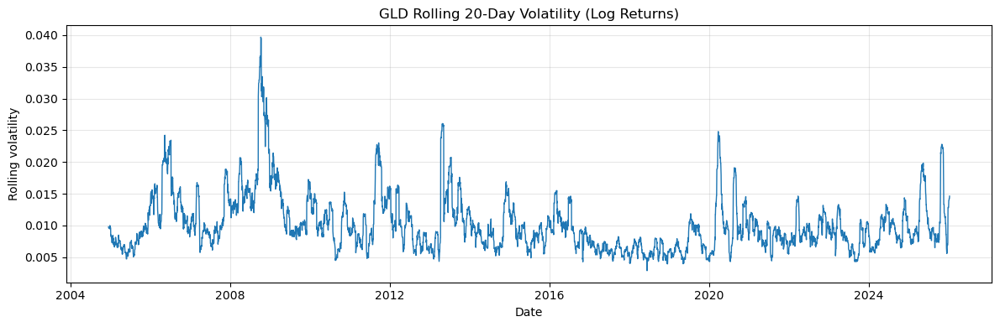
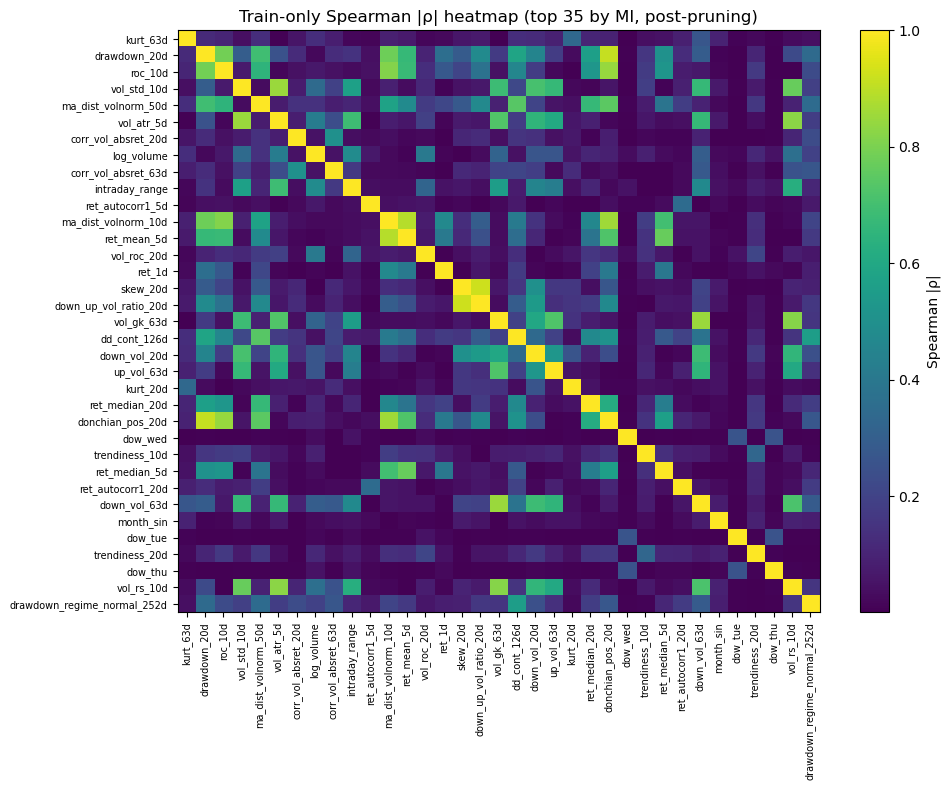
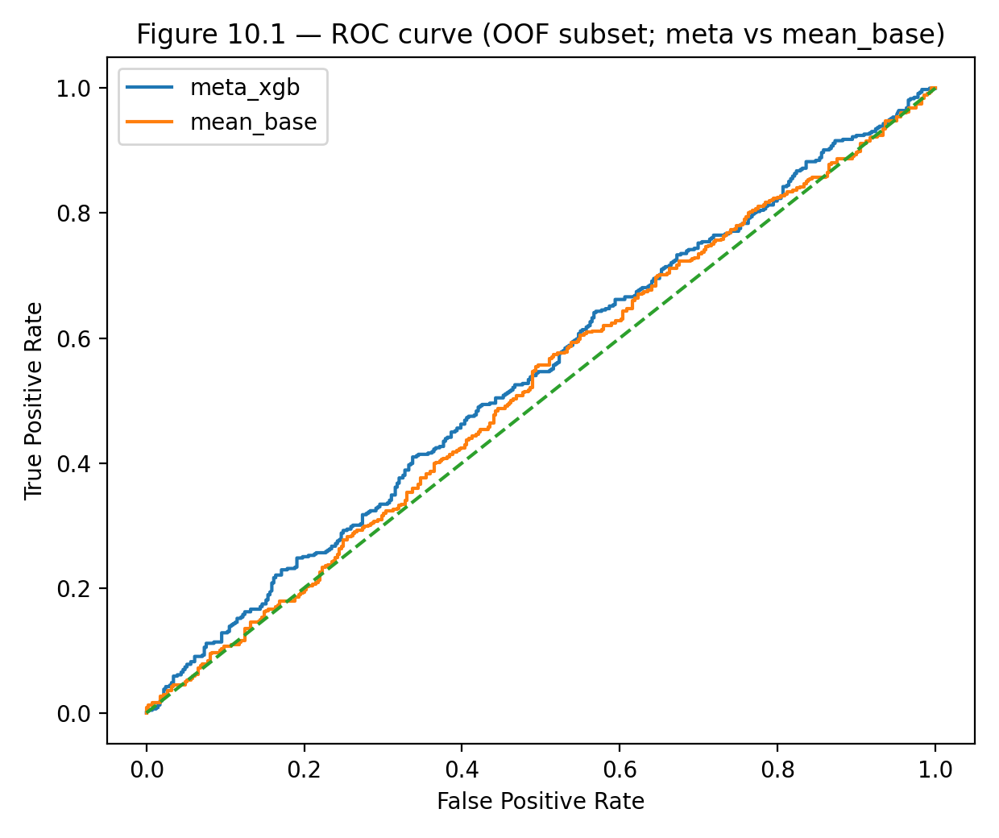
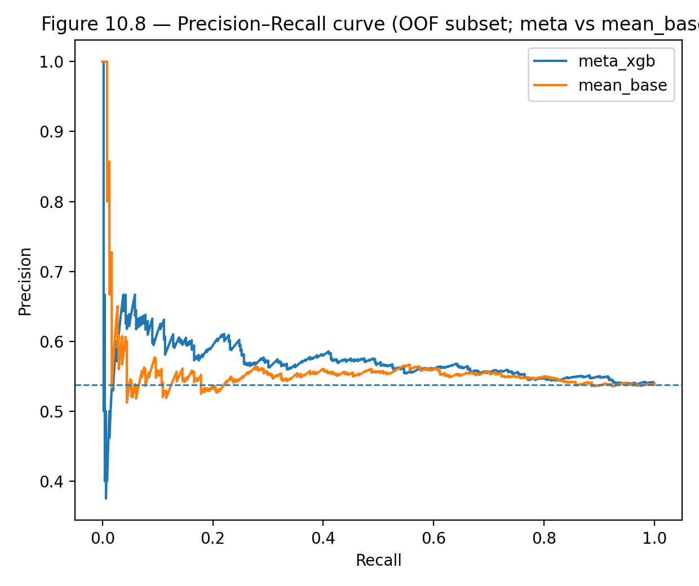
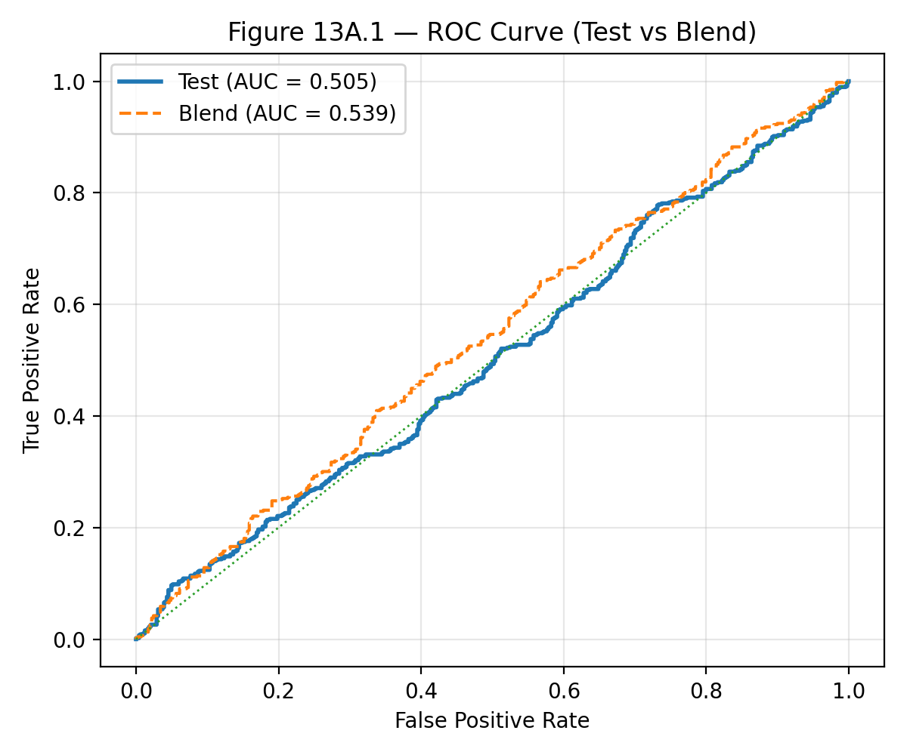
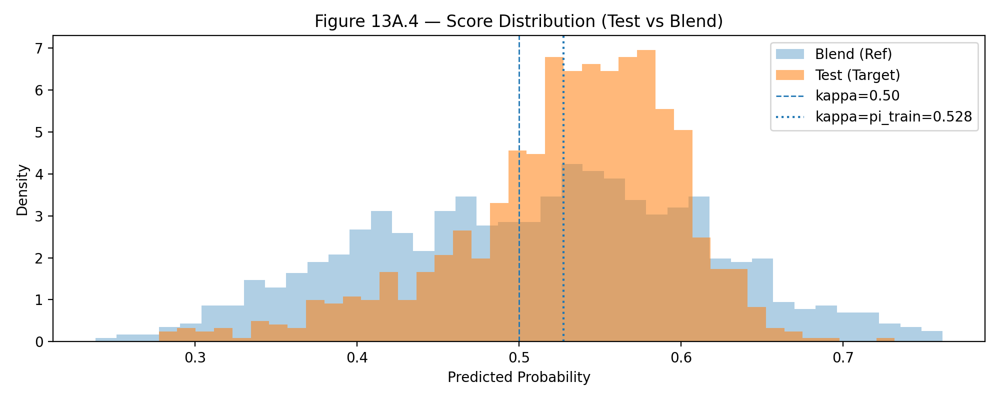
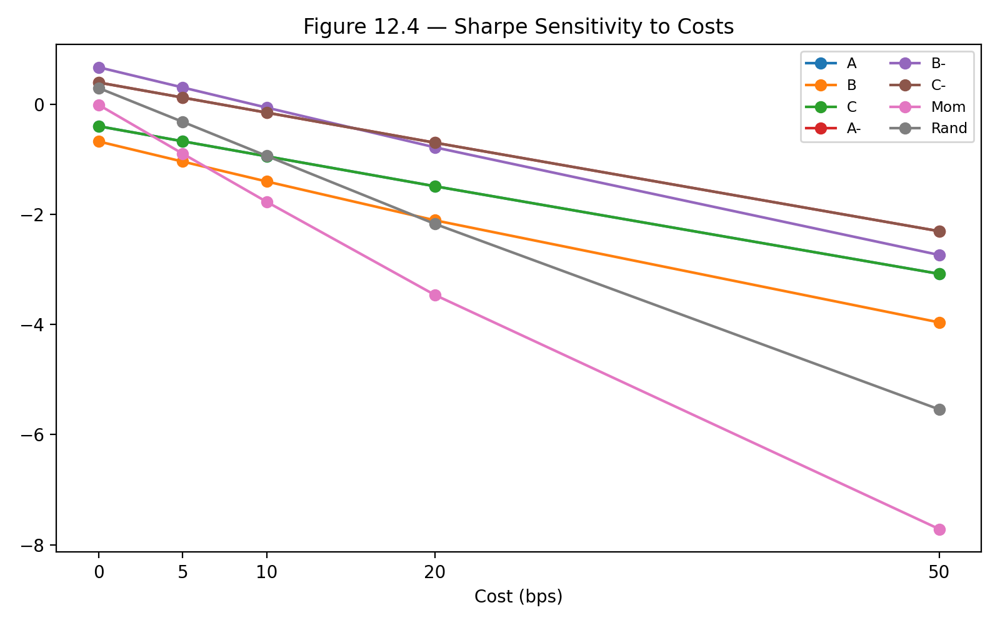
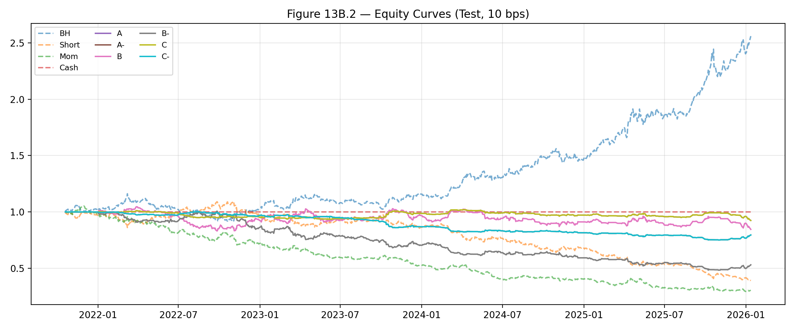

# GLD Short-Horizon Trend Blending Ensemble

Leakage-aware blending ensemble for next-day GLD trend prediction using a forward-only train-blend-test pipeline, disciplined feature reduction, and cost-aware backtesting under strict no-look-ahead constraints.

## Overview

This repository contains my CQF Final Project on short-horizon trend classification for the SPDR Gold Trust ETF (GLD). The project studies whether a machine learning blending ensemble can extract a statistically detectable and economically meaningful next-day directional signal from daily OHLCV data when the entire workflow is designed to prevent leakage.

Rather than optimizing for an attractive in-sample result, the project is built around a research-grade evaluation framework:

- chronological Train / Blend / Test separation
- train-only feature selection and preprocessing
- train-only hyperparameter tuning and calibration
- blend-only meta-learning
- frozen final evaluation on a held-out test window

The final conclusion is deliberately conservative: while the ensemble shows modest diagnostic promise on the Blend window, true forward performance on the Test window is close to random in classification terms and fragile under realistic transaction costs.

## Visual Summary

### Market Regime Context


### Train-Only Feature Structure


### Blend Diagnostic Performance


### Blend Precision-Recall Performance


### True Forward Test Performance


### Score Distribution Shift from Blend to Test


### Sharpe Sensitivity to Transaction Costs


### Forward Equity Curves at 10 bps


## Research Question

Can a leakage-controlled blending ensemble built on daily GLD OHLCV data produce a robust and economically usable forecast of next-day direction?

This project treats that as a binary classification task:

- **Target = 1** if next-day log return is positive
- **Target = 0** otherwise

To reduce label noise without contaminating evaluation, a small fixed deadzone is applied only on the training slice during model fitting and feature selection. The Blend and Test windows are left untouched.

## Dataset

- **Asset:** SPDR Gold Trust ETF (GLD)
- **Frequency:** Daily
- **Inputs:** Open, High, Low, Close, Volume (OHLCV)
- **Sample:** 18 Nov 2004 to 12 Jan 2026
- **Observations:** 5,320 daily rows
- **Source:** `yfinance`
- **Storage policy:** cached locally for reproducibility

GLD was chosen as a liquid single-asset setting with long history, multiple volatility regimes, and enough structure to test whether short-horizon direction forecasting survives strict forward-only validation.

## Pipeline Design

The entire pipeline is built to enforce temporal correctness.

### 1. Causal feature construction

A broad feature universe is engineered using only information available up to time `t`, then globally lagged once so the model input at date `t` depends only on information known at `t-1` or earlier.

### 2. Deterministic time split

The aligned dataset is split chronologically:

- **Train:** first 60%
- **Blend:** next 20%
- **Test:** final 20%

This produces:

- **Train:** 3,192 rows
- **Blend:** 1,064 rows
- **Test:** 1,064 rows

A fixed 5 bps deadzone is applied only to Train, removing near-zero-return observations and leaving an effective training sample for model fitting.

### 3. Train-only preprocessing and feature reduction

All preprocessing parameters are fitted on the effective training set only and then carried forward unchanged.

The project starts with an overcomplete feature universe and reduces it through a documented train-only funnel:

- Mutual Information relevance screening
- Spearman redundancy pruning
- Elastic Net wrapper selection
- time-series recursive feature elimination

This produces a compact frozen feature interface for downstream modeling.

### 4. Base learner training

Heterogeneous model families are tuned under time-series cross-validation on the training slice. The final frozen base learner set used for blending includes:

- Elastic Net Logistic Regression
- RBF SVM
- ExtraTrees
- XGBoost
- MLP

### 5. Blend-stage stacking

Base learner probabilities on the reserved Blend window are used as meta-features for a blending model. The selected final meta-model is an XGBoost classifier trained only on blend-stage inputs.

### 6. Final frozen test evaluation

No refit, recalibration, or threshold tuning is performed on Test. The frozen pipeline is evaluated once for:

- classification performance
- probability behavior
- threshold diagnostics
- trading performance
- turnover sensitivity
- transaction cost robustness
- regime stability

## Feature Universe

The raw feature space spans multiple market descriptors derived only from GLD OHLCV:

- return memory and persistence
- intraday candle geometry
- volatility and range-based estimators
- distribution and tail-risk diagnostics
- trend and momentum geometry
- volume and participation features
- slow regime-state indicators
- calendar controls

The feature universe is intentionally broad at the start, with dimensionality reduction handled later under strict train-only discipline.

## Methodological Highlights

This project was designed to emphasize sound quantitative research practice rather than headline backtest performance.

Key methodological choices include:

- strict forward-only chronological evaluation
- no-look-ahead feature alignment through a single global lag
- train-only feature conditioning and reduction
- blend-only meta-learning
- frozen final test evaluation
- explicit transaction-cost-aware backtesting
- regime-aware robustness analysis

## Key Results

### Blend-window diagnostic result

On the Blend window, the final ensemble shows modest improvement over individual base learners, suggesting some value in combining heterogeneous model outputs under controlled temporal separation.

### True forward test result

That diagnostic improvement does not carry over meaningfully to the frozen Test window. Out-of-sample classification performance is close to random, indicating that the apparent signal does not generalize robustly under forward evaluation.

### Trading result

The classification outputs are translated into a cost-aware backtest. While model-driven overlays show some gross promise before costs, the edge is weak relative to passive exposure and deteriorates materially once realistic transaction costs are imposed.

## Interpretation

The main conclusion of the project is not that the ensemble "works", but that a leakage-aware and methodologically disciplined pipeline can still fail honestly under true forward evaluation.

For short-horizon trend prediction on a liquid asset like GLD:

- weak diagnostic improvements are not enough
- regime shifts can compress probability resolution
- turnover can destroy modest gross edge
- robustness matters more than isolated headline metrics

The study therefore ends with a non-deployment conclusion: the frozen pipeline does not provide statistically robust, economically durable short-horizon predictability in this setting.

## Why This Project Matters

This project is less about presenting a flashy alpha claim and more about demonstrating disciplined quantitative research:

- explicit no-leakage design
- proper temporal validation
- auditable feature engineering and reduction
- heterogeneous model blending
- honest negative-result reporting
- economic evaluation with trading frictions
- regime-aware stress testing

That combination is more informative than an attractive backtest produced under a weak evaluation design.

## Repository Structure

```text
.
├── assets/
│   ├── figure_4_4_rolling_volatility.png
│   ├── figure_6_1_feature_correlation_heatmap.png
│   ├── figure_11_1_blend_roc.png
│   ├── figure_11_2_blend_pr.png
│   ├── figure_13_3_sharpe_sensitivity_costs.png
│   ├── figure_14_1_test_roc.png
│   ├── figure_14_4_test_vs_blend_score_distribution.png
│   └── figure_14_6_test_equity_10bps.png
├── data/
│   └── README.md
├── notebook/
│   └── ML Kartik Vij.ipynb
├── report/
│   └── ML Kartik Vij REPORT.pdf
├── .gitignore
├── LICENSE
├── README.md
└── requirements.txt
```

## Reproducibility Notes

- Data retrieval is cached locally for consistency across runs.
- All feature engineering, filtering, scaling, and model selection steps are performed under train-only discipline.
- The blend window is reserved for meta-learning only.
- The test window is untouched until final evaluation.
- No adaptive threshold tuning is performed on the final test sample.

## Main Takeaway

A blending ensemble can look directionally promising in a controlled diagnostic window, yet still fail to deliver robust forward predictability once regime shifts and realistic trading costs are imposed.

That negative result is still valuable. It shows the difference between apparent signal and deployable signal, which is exactly the distinction careful quantitative research should make.

## Author

**Kartik Vij**  
CQF Final Project  
CQF June 2025 Cohort

## Disclaimer

This repository is intended for research and educational purposes only. It does not constitute investment advice or a claim of deployable trading profitability.